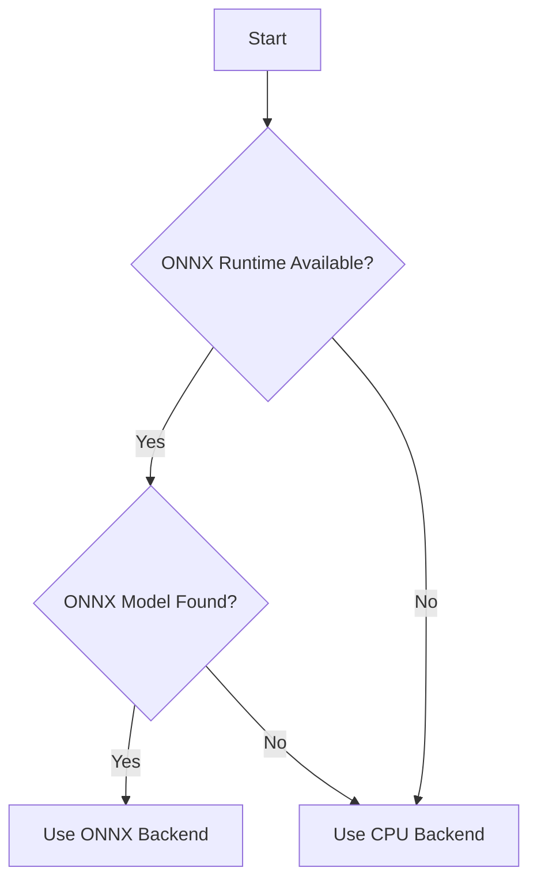

# NoDupeLabs AI Backend System

This guide provides comprehensive documentation for the optional ONNX-based ML backend and CPU fallback system in NoDupeLabs.

## Table of Contents

- [Overview](#overview)
- [Design Goals](#design-goals)
- [Architecture](#architecture)
- [Configuration](#configuration)
- [Compatibility and Vendoring](#compatibility-and-vendoring)
- [Usage Examples](#usage-examples)
- [Testing](#testing)
- [Troubleshooting](#troubleshooting)

## Overview

NoDupeLabs supports optional AI-based features including NSFW classification and vector embeddings. The system uses a pluggable backend architecture that gracefully degrades when dependencies are not available.

## Design Goals

### Core Principles

1. **Zero Required Dependencies**: Core system works with only standard library
2. **Graceful Degradation**: Optional features fail safely without breaking scans
3. **Flexible Deployment**: Support both online and offline environments
4. **Model Management**: Keep large models separate from core runtime

### Key Features

- **ONNX Runtime Support**: GPU/CPU acceleration when available
- **CPU Fallback**: Pure-Python backend for restricted environments
- **Automatic Detection**: Runtime checks for dependencies and models
- **Vendoring Support**: Offline-friendly deployment options

## Architecture

### Backend Selection



### Component Flow

1. **Backend Discovery**: `choose_backend()` detects available backends
2. **Fallback Mechanism**: Automatically uses CPU backend if ONNX unavailable
3. **Error Handling**: NSFW classifier ignores backend errors gracefully
4. **Performance**: ONNX backend uses hardware acceleration when possible

## Configuration

### Basic Configuration

```yaml
# nodupe.yml - AI configuration
ai:
  enabled: auto            # auto|true|false
  backend: onnxruntime     # onnxruntime or cpu
  model_path: models/nsfw_small.onnx
  threshold: 2             # NSFW classification threshold (0-3)
```

### Configuration Options

| Option | Values | Description |
|--------|--------|-------------|
| `enabled` | `auto`, `true`, `false` | Auto-detect or force enable/disable |
| `backend` | `onnxruntime`, `cpu` | Preferred backend |
| `model_path` | Path to ONNX model | Custom model location |
| `threshold` | 0-3 | NSFW classification sensitivity |

### Configuration Examples

```yaml
# Enable ONNX with custom model
ai:
  enabled: true
  backend: onnxruntime
  model_path: models/custom_nsfw.onnx
  threshold: 2

# Disable AI features completely
ai:
  enabled: false

# Auto-detect (default)
ai:
  enabled: auto
```

## Compatibility and Vendoring

### ONNX Model Compatibility

**Note**: ONNX models target specific IR/opset versions that may not be compatible with older ONNX Runtime builds.

```bash
# Check ONNX model compatibility
python scripts/check_onnx_compatibility.py models/nsfw_small.onnx

# Expected: Model IR version and opset information
```

### Vendoring ONNX Runtime

For offline or reproducible deployments, vendor ONNX Runtime wheels:

```bash
# Vendor ONNX Runtime wheel
python scripts/vendor_onnxruntime_wheel.py

# Install vendored wheel
python scripts/install_vendored_wheels.py --pattern onnxruntime

# Or use pip directly
python -m pip install --no-index --find-links nodupe/vendor/libs onnxruntime
```

### Upgrade with Fallback

Automatically try newer PyPI builds with fallback to vendored versions:

```bash
# Upgrade with fallback
python scripts/upgrade_or_fallback_onnxruntime.py --model models/nsfw_small.onnx

# Force upgrade attempt
python scripts/upgrade_or_fallback_onnxruntime.py --force
```

## Usage Examples

### Basic NSFW Classification

```bash
# Scan with NSFW classification enabled
nodupe scan --root /data --nsfw-enabled true

# Use specific backend
nodupe scan --root /data --nsfw-enabled true --ai-backend onnxruntime

# Adjust classification threshold
nodupe scan --root /data --nsfw-enabled true --nsfw-threshold 2
```

### Advanced Configuration

```bash
# Scan with custom ONNX model
nodupe scan --root /data \
  --nsfw-enabled true \
  --ai-backend onnxruntime \
  --model-path models/custom_nsfw.onnx \
  --nsfw-threshold 3
```

### Backend Selection

```bash
# Force CPU backend (for testing)
nodupe scan --root /data --ai-backend cpu

# Auto-detect backend
nodupe scan --root /data --ai-backend auto

# Disable AI features
nodupe scan --root /data --nsfw-enabled false
```

## Testing

### Unit Testing

```bash
# Run AI backend tests
pytest tests/test_ai_backend.py -v

# Run NSFW integration tests
pytest tests/test_nsfw_integration.py -v

# Run all tests
pytest tests/ -v -m "not slow and not integration"
```

### CI/CD Testing

```yaml
# .github/workflows/test_ai.yml
name: AI Backend Tests

on: [push, pull_request]

jobs:
  test:
    runs-on: ubuntu-latest
    steps:
    - uses: actions/checkout@v2
    - name: Set up Python
      uses: actions/setup-python@v2
      with:
        python-version: '3.9'
    - name: Install dependencies
      run: |
        pip install -e .
        pip install pytest
    - name: Run AI tests
      run: |
        pytest tests/test_ai_backend.py -v
        pytest tests/test_nsfw_integration.py -v
```

## Troubleshooting

### Common Issues

**Issue**: ONNX Runtime not available

```bash
# Install ONNX Runtime
pip install onnxruntime

# Or use CPU backend
nodupe scan --root /data --ai-backend cpu
```

**Issue**: ONNX model incompatible

```bash
# Check model compatibility
python scripts/check_onnx_compatibility.py models/your_model.onnx

# Use compatible model
nodupe scan --root /data --model-path models/compatible_model.onnx
```

**Issue**: NSFW classification not working

```bash
# Check backend availability
nodupe check-ai-backend

# Enable verbose logging
export NO_DUPE_DEBUG=1
nodupe scan --root /data --nsfw-enabled true
```

### Debugging Techniques

```bash
# Enable debug logging
export NO_DUPE_DEBUG=1

# Check AI backend status
nodupe check-ai-backend

# Test backend directly
python -c "from nodupe.ai.backends import choose_backend; print(choose_backend())"
```

## Best Practices

### Model Management

- **Version Control**: Track model versions with your data
- **Compatibility Testing**: Verify models work with your ONNX Runtime version
- **Fallback Planning**: Ensure CPU backend works as expected
- **Performance Monitoring**: Track inference times and accuracy

### Deployment Strategies

| Environment | Recommended Approach |
|-------------|---------------------|
| Development | Auto-detect with PyPI fallback |
| Production | Vendor specific ONNX Runtime version |
| Offline | Vendor all dependencies |
| Cloud | Use GPU-accelerated ONNX Runtime |

## Conclusion

The NoDupeLabs AI backend system provides **flexible, robust support** for optional AI features with graceful degradation. Use ONNX Runtime for performance or the CPU backend for compatibility.

**Next Steps**:
- Try the [Advanced Usage Guide](ADVANCED_USAGE.md) for complex scenarios
- Explore [Integration Guides](INTEGRATION_GUIDES.md) for platform examples
- Review [Documentation Guide](DOCUMENTATION_GUIDE.md) to contribute new features
