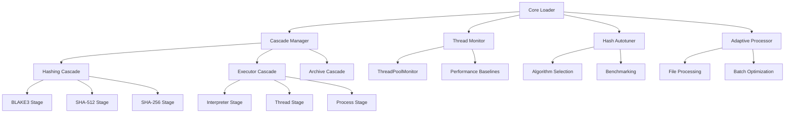

# Cascade-Autotune Integration Guide

## Overview

The Cascade-Autotune Integration Framework provides intelligent performance optimization and degradation management for NoDupesLab. This guide covers installation, configuration, usage examples, and troubleshooting.

## Table of Contents

1. [Architecture Overview](#architecture-overview)
2. [Installation & Setup](#installation--setup)
3. [Configuration](#configuration)
4. [Usage Examples](#usage-examples)
5. [Performance Optimization](#performance-optimization)
6. [Failure Modes & Troubleshooting](#failure-modes--troubleshooting)
7. [API Reference](#api-reference)
8. [Best Practices](#best-practices)

## Architecture Overview

### Core Components



### Integration Points

- **Core Loader**: Bootstrap sequence integration
- **Service Container**: Dependency injection services
- **Plugin System**: Cascade stage plugins
- **File Processing**: Adaptive processing pipeline
- **Database**: Performance metrics storage

## Installation & Setup

### Prerequisites

- Python 3.9+
- NoDupesLab v2.0+
- Standard library only (no external dependencies required)

### Automatic Installation

The Cascade-Autotune framework is automatically installed with NoDupesLab:

```bash
# Install NoDupesLab (includes Cascade-Autotune)
pip install nodupelabs

# Verify installation
nodupe --version
```

### Manual Installation

For development or custom installations:

```bash
# Clone repository
git clone https://github.com/allaunthefox/NoDupeLabs.git
cd NoDupeLabs

# Install in development mode
pip install -e .

# Verify cascade components
python -c "from nodupe.core.cascade.manager import CascadeManager; print('Cascade Manager available')"
```

### Verification

```bash
# Check cascade services status
nodupe status --cascade

# Expected output:
# [INFO] Cascade Manager: Active
# [INFO] Thread Monitor: Active  
# [INFO] Hash Autotuner: Active
# [INFO] Adaptive Processor: Active
```

## Configuration

### Basic Configuration

Create or update `nodupe.yml`:

```yaml
# Enable cascade framework
cascade:
  enabled: true
  availability_ttl: 30.0
  performance_monitoring: true
  thread_monitoring: true

# Configure cascade stages
cascade:
  stages:
    hashing: ["blake3", "sha512", "sha256", "md5"]
    executor: ["interpreter", "thread", "process"]

# Configure thread pool
cascade:
  thread_pool:
    max_workers: 16
    monitoring_interval: 10
    degradation_threshold: 1.5
```

### Advanced Configuration

```yaml
# Complete configuration example
cascade:
  enabled: true
  availability_ttl: 30.0
  performance_monitoring: true
  thread_monitoring: true
  
  # Stage-specific configuration
  stages:
    hashing:
      algorithms: ["blake3", "sha512", "sha256", "md5"]
      quality_tiers: ["best", "good", "acceptable", "minimal"]
      fallback_timeout: 5.0
    
    executor:
      types: ["interpreter", "thread", "process"]
      quality_tiers: ["best", "good", "acceptable"]
      worker_limits: [8, 16, 4]
    
    archive:
      formats: ["zip", "tar", "basic"]
      quality_tiers: ["best", "good", "acceptable"]

  # Thread pool configuration
  thread_pool:
    max_workers: 16
    monitoring_interval: 10
    degradation_threshold: 1.5
    worker_adjustment_cooldown: 30
    overload_cpu_threshold: 90
    overload_memory_threshold: 85

  # Performance monitoring
  performance:
    baseline_update_interval: 60
    metrics_retention: 3600
    alert_thresholds:
      degradation: 2.0
      failure_rate: 0.1
      response_time: 10.0

  # Autotuning configuration
  autotuning:
    sample_size: 1048576  # 1MB
    iterations: 10
    file_size_threshold: 10485760  # 10MB
    memory_constrained: false
```

### Environment-Specific Configurations

#### Development Environment

```yaml
# development.yml
cascade:
  enabled: false  # Disable for simpler debugging
  performance_monitoring: false
  thread_monitoring: false
```

#### Production Environment

```yaml
# production.yml
cascade:
  enabled: true
  availability_ttl: 60.0  # Longer cache for stability
  performance_monitoring: true
  thread_monitoring: true
  
  thread_pool:
    max_workers: 32
    monitoring_interval: 5  # More frequent monitoring
    degradation_threshold: 1.2  # Stricter thresholds
```

#### Constrained Environment

```yaml
# constrained.yml
cascade:
  enabled: true
  availability_ttl: 15.0  # Shorter cache for responsiveness
  performance_monitoring: false  # Reduce overhead
  thread_monitoring: true
  
  thread_pool:
    max_workers: 4  # Conservative worker count
    monitoring_interval: 30  # Less frequent monitoring
    degradation_threshold: 2.0  # More lenient thresholds
```

## Usage Examples

### Basic Usage

```python
from nodupe.core.container import container
from nodupe.core.cascade.manager import CascadeManager

# Get cascade manager from container
cascade_manager = container.get_service('cascade_manager')

# Execute hashing with cascade
file_path = "/path/to/file.txt"
file_hash = cascade_manager.execute_cascade("hashing", file_path)
print(f"File hash: {file_hash}")

# Execute batch processing with adaptive executor
file_paths = ["/path/to/file1.txt", "/path/to/file2.txt"]
results = cascade_manager.execute_cascade("executor", process_files, file_paths)
```

### Advanced Usage

```python
from nodupe.core.cascade.stages.adaptive_hash import PerformanceAwareHashStage
from nodupe.core.cascade.monitoring.thread_monitor import ThreadPoolMonitor

# Create custom adaptive stage
tuner = HashAutotuner(sample_size=1024*1024)
thread_monitor = ThreadPoolMonitor(max_workers=8)

adaptive_stage = PerformanceAwareHashStage(
    quality_tier=QualityTier.BEST,
    tuner=tuner,
    thread_monitor=thread_monitor
)

# Register custom stage
cascade_manager.register_cascade("custom_hashing", [adaptive_stage])

# Execute with custom cascade
result = cascade_manager.execute_cascade("custom_hashing", "/path/to/file.txt")
```

### Plugin Integration

```python
from nodupe.core.plugin_system.base import Plugin
from nodupe.core.cascade.stages.base import CascadeStage

class CustomHashPlugin(Plugin):
    @property
    def name(self) -> str:
        return "custom_hash_plugin"
    
    @property 
    def version(self) -> str:
        return "1.0.0"
    
    def initialize(self, container):
        # Register custom cascade stage
        custom_stage = CustomHashStage()
        cascade_manager = container.get_service('cascade_manager')
        cascade_manager.register_stage(custom_stage)
    
    def get_capabilities(self) -> dict:
        return {
            "cascade_stages": ["custom_hash"],
            "algorithms": ["custom_algo"]
        }

# Plugin will be automatically discovered and loaded
```

### Performance Monitoring

```python
from nodupe.core.cascade.monitoring.performance import PerformanceMonitor

# Get performance monitor
performance_monitor = container.get_service('performance_monitor')

# Monitor specific operation
with performance_monitor.monitor("file_processing") as monitor:
    # Perform operation
    result = process_large_files(file_list)
    
    # Get performance metrics
    metrics = monitor.get_metrics()
    print(f"Duration: {metrics['duration']:.3f}s")
    print(f"Throughput: {metrics['throughput']:.2f} files/sec")

# Get system-wide performance summary
summary = performance_monitor.get_summary()
print(f"Average response time: {summary['avg_response_time']:.3f}s")
print(f"Success rate: {summary['success_rate']:.2%}")
```

## Performance Optimization

### Algorithm Selection

The framework automatically selects optimal algorithms based on:

1. **System Resources**: CPU, memory, and storage type
2. **File Characteristics**: Size, type, and content
3. **Performance History**: Historical performance data
4. **Current Load**: System load and resource availability

```python
# View current algorithm selection
autotune_results = container.get_service('hash_autotune_results')
print(f"Optimal algorithm: {autotune_results['optimal_algorithm']}")
print(f"Benchmark results: {autotune_results['benchmark_results']}")

# Force algorithm selection (for testing)
from nodupe.core.scan.hasher import FileHasher
custom_hasher = FileHasher(algorithm='blake3')
container.register_service('hasher', custom_hasher)
```

### Thread Pool Optimization

Automatic thread pool optimization based on:

1. **CPU Cores**: Available processing power
2. **Memory**: Available system memory
3. **I/O Patterns**: Disk and network I/O characteristics
4. **System Load**: Current system utilization

```python
# Monitor thread pool status
thread_monitor = container.get_service('thread_monitor')
metrics = thread_monitor.get_current_metrics()
print(f"Active threads: {metrics.active_threads}/{metrics.max_threads}")
print(f"CPU usage: {metrics.cpu_usage:.1f}%")
print(f"Memory usage: {metrics.memory_usage:.1f}%")

# Adjust thread pool manually (advanced)
thread_monitor.set_max_workers(32)
```

### Batch Size Optimization

Automatic batch size optimization based on:

1. **File Size Distribution**: Average and maximum file sizes
2. **Memory Constraints**: Available memory for processing
3. **I/O Throughput**: Disk read/write performance
4. **Processing Time**: Historical processing times

```python
# Get optimal batch size
scheduler = container.get_service('workload_scheduler')
optimal_batch_size = scheduler.get_optimal_batch_size("hashing")
print(f"Optimal batch size: {optimal_batch_size}")

# Configure batch processing
from nodupe.core.cascade.stages.thread_aware import ThreadAwareExecutorStage
stage = ThreadAwareExecutorStage(
    executor_type="thread",
    quality_tier=QualityTier.GOOD,
    tuner=tuner,
    thread_monitor=thread_monitor,
    batch_size=optimal_batch_size
)
```

## Failure Modes & Troubleshooting

### Complete Cascade Failure

**Symptoms**:
- All cascade services unavailable
- System falls back to standard operation
- Performance degradation (20-30%)

**Causes**:
- Import errors for cascade modules
- System resource detection failures
- Configuration errors

**Resolution**:
```bash
# Check cascade status
nodupe status --cascade

# Enable debug logging
export NODUPE_DEBUG=1
nodupe scan --root /path/to/files

# Check logs for cascade errors
grep -i "cascade" logs/nodupe.log
```

### Partial Cascade Failure

**Symptoms**:
- Some cascade features working, others not
- Inconsistent performance
- Mixed error messages

**Common Issues**:

1. **Thread Monitor Failure**:
   ```python
   # Check thread monitor status
   thread_monitor = container.get_service('thread_monitor')
   if thread_monitor is None:
       print("Thread monitor failed - using standard threading")
   ```

2. **Hash Autotuner Failure**:
   ```python
   # Check autotuner status
   tuner = container.get_service('hash_autotuner')
   if tuner is None:
       print("Autotuner failed - using conservative defaults")
   ```

3. **Plugin Loading Issues**:
   ```bash
   # Check plugin status
   nodupe status --plugins
   
   # Reload plugins
   nodupe plugins reload
   ```

### Performance Issues

**Symptoms**:
- Slower than expected processing
- High resource usage
- Timeout errors

**Diagnosis**:

```python
# Check performance metrics
performance_monitor = container.get_service('performance_monitor')
summary = performance_monitor.get_summary()

# Check for performance bottlenecks
if summary['avg_response_time'] > 10.0:
    print("High response time detected")
if summary['success_rate'] < 0.95:
    print("High failure rate detected")
if summary['resource_usage']['cpu'] > 80:
    print("High CPU usage detected")
```

**Optimization**:

```yaml
# Optimize for performance issues
cascade:
  thread_pool:
    max_workers: 8  # Reduce workers to reduce contention
    monitoring_interval: 20  # Less frequent monitoring
    degradation_threshold: 2.0  # More lenient thresholds
  
  performance:
    baseline_update_interval: 120  # Slower baseline updates
    alert_thresholds:
      degradation: 3.0  # Higher degradation threshold
      response_time: 20.0  # Higher response time threshold
```

### Configuration Issues

**Common Problems**:

1. **Invalid Configuration**:
   ```yaml
   # WRONG - Invalid syntax
   cascade:
     stages: "blake3, sha256"  # Should be list
   
   # CORRECT - Valid syntax
   cascade:
     stages: ["blake3", "sha256"]
   ```

2. **Missing Dependencies**:
   ```bash
   # Check for missing optional dependencies
   python -c "import blake3; print('BLAKE3 available')"
   python -c "import xxhash; print('xxHash available')"
   ```

3. **Permission Issues**:
   ```bash
   # Check file permissions
   ls -la /path/to/nodupe/
   
   # Fix permissions if needed
   chmod -R u+rw /path/to/nodupe/
   ```

### Debug Mode

Enable comprehensive debugging:

```bash
# Enable debug mode
export NODUPE_DEBUG=1
export NODUPE_CASCADE_DEBUG=1

# Run with verbose output
nodupe scan --root /path/to/files --verbose

# Check debug logs
tail -f logs/nodupe.log | grep -i "cascade\|autotune\|thread"
```

### Recovery Procedures

**Automatic Recovery**:
- System automatically falls back to standard operation
- No manual intervention required
- Graceful degradation maintains functionality

**Manual Recovery**:
```bash
# Disable cascade temporarily
echo "cascade:\n  enabled: false" > cascade-disable.yml
nodupe --config cascade-disable.yml scan --root /path/to/files

# Re-enable cascade after fixing issues
echo "cascade:\n  enabled: true" > cascade-enable.yml
nodupe --config cascade-enable.yml scan --root /path/to/files
```

## API Reference

### Core Classes

#### CascadeManager

```python
class CascadeManager:
    def __init__(self, container):
        """Initialize cascade manager with dependency container"""
    
    def register_cascade(self, name: str, stages: List[CascadeStage]) -> None:
        """Register a new cascade with stages"""
    
    def execute_cascade(self, cascade_name: str, *args, **kwargs) -> Any:
        """Execute cascade with automatic fallback"""
    
    def get_cascade_status(self, cascade_name: Optional[str] = None) -> Dict[str, Any]:
        """Get cascade status and availability"""
    
    def set_availability_ttl(self, seconds: float) -> None:
        """Set availability cache TTL"""
    
    def clear_availability_cache(self) -> None:
        """Clear availability cache"""
```

#### ThreadPoolMonitor

```python
class ThreadPoolMonitor:
    def __init__(self, max_workers: int = None):
        """Initialize thread pool monitor"""
    
    def get_current_metrics(self) -> ThreadPoolMetrics:
        """Get current thread pool metrics"""
    
    def get_pool_state(self) -> ThreadPoolState:
        """Get current pool state"""
    
    def should_reduce_workers(self) -> bool:
        """Check if workers should be reduced"""
    
    def should_increase_workers(self) -> bool:
        """Check if workers can be increased"""
    
    def get_recommended_workers(self) -> int:
        """Get recommended worker count"""
```

#### HashAutotuner

```python
class HashAutotuner:
    def __init__(self, sample_size: int = 1024*1024):
        """Initialize hash autotuner"""
    
    def select_optimal_algorithm(self, iterations: int = 10) -> Tuple[str, Dict[str, float]]:
        """Select optimal hash algorithm"""
    
    def benchmark_algorithm(self, algorithm_name: str, test_data: bytes, iterations: int = 10) -> float:
        """Benchmark specific algorithm"""
    
    def get_algorithm_recommendation(self, file_size_threshold: int = 10*1024*1024) -> Dict[str, str]:
        """Get algorithm recommendations"""
```

### Configuration Schema

```yaml
# Complete configuration schema
cascade:
  enabled: boolean                    # Enable/disable cascade framework
  availability_ttl: number           # Availability cache TTL in seconds
  performance_monitoring: boolean    # Enable performance monitoring
  thread_monitoring: boolean         # Enable thread monitoring
  
  stages:
    hashing:                         # Hashing cascade configuration
      algorithms: [string]           # List of hash algorithms
      quality_tiers: [string]        # Quality tiers for algorithms
      fallback_timeout: number       # Timeout for fallback operations
    
    executor:                        # Executor cascade configuration
      types: [string]                # List of executor types
      quality_tiers: [string]        # Quality tiers for executors
      worker_limits: [number]        # Worker limits for each type
    
    archive:                         # Archive cascade configuration
      formats: [string]              # List of archive formats
      quality_tiers: [string]        # Quality tiers for formats

  thread_pool:
    max_workers: number              # Maximum number of workers
    monitoring_interval: number      # Monitoring interval in seconds
    degradation_threshold: number    # Performance degradation threshold
    worker_adjustment_cooldown: number # Worker adjustment cooldown
    overload_cpu_threshold: number   # CPU usage overload threshold
    overload_memory_threshold: number # Memory usage overload threshold

  performance:
    baseline_update_interval: number # Baseline update interval
    metrics_retention: number        # Metrics retention period
    alert_thresholds:                # Alert thresholds
      degradation: number            # Degradation alert threshold
      failure_rate: number           # Failure rate alert threshold
      response_time: number          # Response time alert threshold

  autotuning:
    sample_size: number              # Sample size for benchmarking
    iterations: number               # Number of benchmark iterations
    file_size_threshold: number      # File size threshold for recommendations
    memory_constrained: boolean      # Memory constraint flag
```

## Best Practices

### Configuration Best Practices

1. **Start Conservative**: Begin with conservative settings and optimize gradually
2. **Monitor Performance**: Regularly monitor performance metrics and adjust accordingly
3. **Environment-Specific**: Use different configurations for different environments
4. **Backup Configurations**: Keep backup configurations for quick recovery

### Performance Best Practices

1. **Regular Benchmarking**: Run regular benchmarks to ensure optimal performance
2. **Monitor Resource Usage**: Keep track of CPU, memory, and I/O usage
3. **Adjust Based on Workload**: Adjust configuration based on actual workload characteristics
4. **Use Appropriate Quality Tiers**: Choose quality tiers based on requirements vs. performance trade-offs

### Troubleshooting Best Practices

1. **Enable Debug Logging**: Use debug logging for detailed troubleshooting
2. **Check System Resources**: Always check system resources when performance issues occur
3. **Test with Smaller Datasets**: Test configurations with smaller datasets first
4. **Document Changes**: Document configuration changes and their effects

### Security Best Practices

1. **Secure Configuration Files**: Protect configuration files from unauthorized access
2. **Validate Input**: Always validate configuration input
3. **Use Secure Defaults**: Use secure defaults for all configuration options
4. **Regular Security Reviews**: Regularly review configuration for security issues

### Development Best Practices

1. **Use Development Configuration**: Use conservative configurations during development
2. **Test Cascade Disable**: Test that system works when cascade is disabled
3. **Monitor Plugin Loading**: Monitor plugin loading and initialization
4. **Handle Failures Gracefully**: Always handle cascade failures gracefully

## Conclusion

The Cascade-Autotune Integration Framework provides powerful performance optimization and degradation management capabilities for NoDupesLab. By following this guide, you can:

- **Install and configure** the framework correctly
- **Optimize performance** for your specific use cases
- **Troubleshoot issues** effectively
- **Maintain system reliability** through proper configuration and monitoring

The framework is designed to be **user-friendly**, **reliable**, and **performant**, providing significant benefits while maintaining the robustness and simplicity of the core NoDupesLab system.
